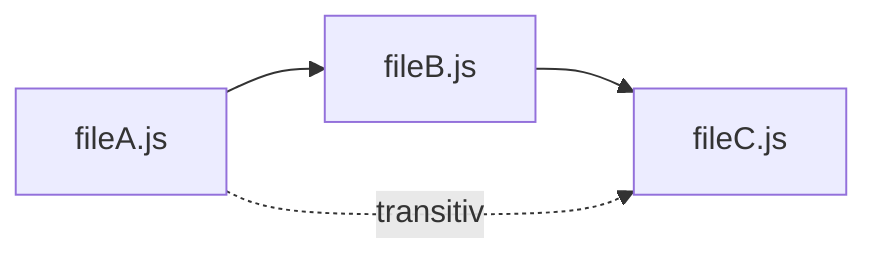

# Scenario 1: Simple Import Chain

## Descripción

Caso de prueba básico: cadena de dependencias lineal A → B → C

Este es el caso más simple para validar que la Capa A (Análisis Estático) funciona correctamente.

## Estructura

```
src/
├── fileA.js  (importa B, exporta functionA)
├── fileB.js  (importa C, exporta functionB)
└── fileC.js  (exporta functionC)
```

## Dependencias

**Directas**:
- `fileA.js` → `fileB.js` (import directo)
- `fileB.js` → `fileC.js` (import directo)

**Indirectas (transitivas)**:
- `fileA.js` → `fileC.js` (a través de B)

## Grafo Esperado



## Test Cases

### Test 1: Detectar Dependencias Directas
**Acción**: Ejecutar indexer estático
**Resultado esperado**:
```json
{
  "dependencies": [
    { "from": "fileA.js", "to": "fileB.js", "type": "import" },
    { "from": "fileB.js", "to": "fileC.js", "type": "import" }
  ]
}
```

### Test 2: Calcular Dependientes
**Acción**: Preguntar "¿Quién usa fileC.js?"
**Resultado esperado**:
```json
{
  "directDependents": ["fileB.js"],
  "indirectDependents": ["fileA.js"]
}
```

### Test 3: Análisis de Impacto
**Acción**: Simular edición de `fileC.js`
**Resultado esperado**: Advertencia de que `fileA.js` y `fileB.js` pueden verse afectados

## Criterios de Éxito

- ✅ Detecta ambas dependencias directas
- ✅ Calcula dependientes correctamente
- ✅ No reporta falsos positivos (ej: fileC → fileA)
- ✅ Genera advertencia al editar cualquier archivo de la cadena

## Complejidad

**Nivel**: ⭐ Básico

Este es el caso más simple posible. Si falla, hay un problema fundamental en el parser.
